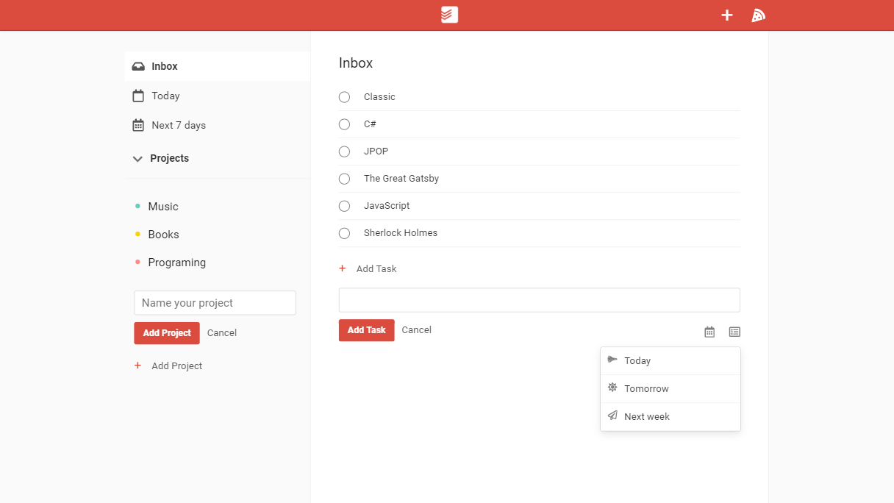
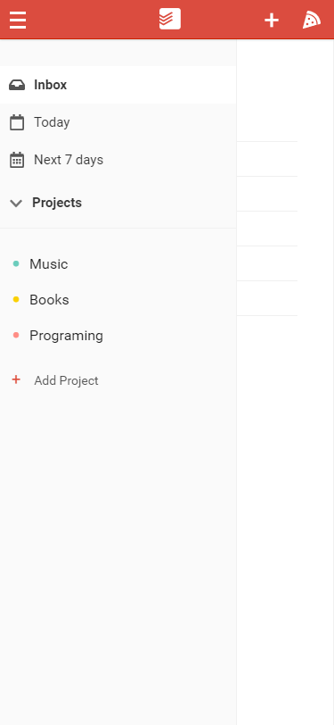
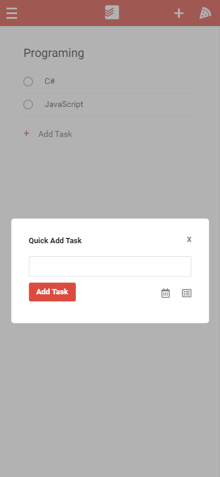

# Todo App

A todoist clone built with React (Context, Custom Hooks) and firebase.

## Preview





## Installation

1. Have a project in firebase and get the configuration.
2. Touch a new fire `firebase.js` in `src/`
3. Edit it as follows.

```
import firebase from "firebase/app";
import "firebase/firestore";

const firebaseConfig = firebase.initializeApp({
  apiKey: "",
  authDomain: "",
  databaseURL: "",
  projectId: "",
  storageBucket: "",
  messagingSenderId: "",
  appId: "",
});

export { firebaseConfig as firebase };
```

4. Run the app.

```
#install dependencies
yarn

#run
yarn start
```
